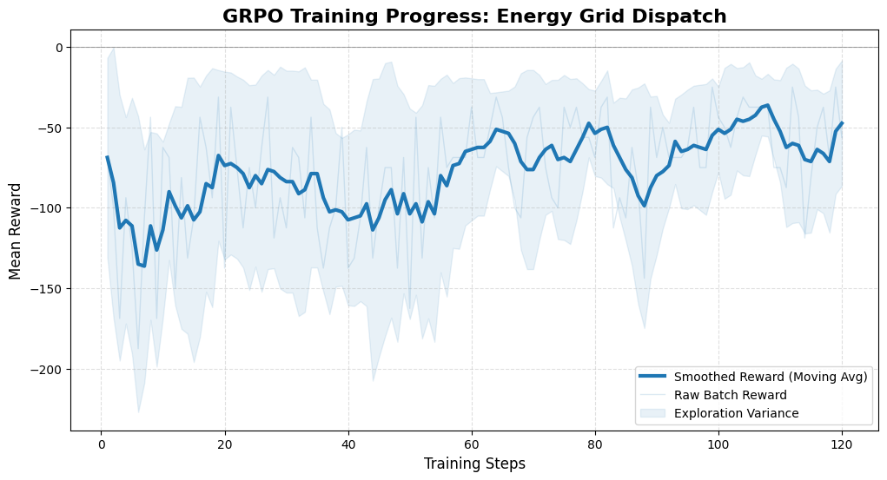

Additional Links:
hf spaces:https://huggingface.co/spaces/MHussain17/energy_grid_env

Youtube link for the pitch : 

Slide deck: 

README

Energy forms the backbone of the modern industry, and being in India, we are very familiar with power cuts, especially during summers which for me are usable the environments to absolutely test my patience to the brink.

Diving a bit deeper into this, I realised that the situation is actually a technical problem. The failure of the electric grid to supply during peak demands can be attributed to several factors, including outdated infrastructure, insufficient generation capacity, and an over-reliance on fossil fuels. The problem becomes more pronounced during the summer months when energy consumption peaks due to increased demand for air conditioning and refrigeration. And that made me think, what if I could create a system that would basically be able to accurately predict and handle loads and demands of the electric grid using the power of AI. 

And so we created this environment, EnergyGridEnv, is a simulation of a real world energy grid with renewable energy sources and energy storage systems. The environment is designed to be used for training and evaluating reinforcement learning algorithms for energy grid management. 
And that’s where things start getting interesting, because this isn’t just a clean, textbook environment where everything behaves nicely. It’s messy, unpredictable, and a little unforgiving… just like the real grid we’re trying to fix. we've tried our best to resort to stochastic methods instead of deterministic ones.
So building on top of that base idea, we pushed the environment way beyond a simple simulation.
First, instead of treating the grid like some static system with fixed numbers, we made the physics itself come alive. Frequency isn’t just a number sitting there behaving, it actually reacts to imbalance in supply and demand through a virtual inertia model. Renewable sources like solar and wind don’t just “exist”, they fluctuate with time, noise, and uncertainty, forcing the agent to deal with the kind of variability that operators actually face. Even the battery isn’t a cheat code, every discharge chips away at its health, so suddenly every decision has a long-term consequence attached to it.

Then we made demand itself more human. Instead of one flat number, the grid now has sectors. Hospitals, industries, homes. And this changes everything. Because now it’s not just optimization, it’s prioritization. The agent has to make uncomfortable decisions. It can’t just balance equations, it has to understand what absolutely cannot fail and what can bend a little. Mess that up repeatedly for hospitals, and the episode just ends. No second chances.
But the real twist comes from uncertainty. We introduced what we call black swan events, sudden collapses in renewable generation that can happen out of nowhere. One moment everything is stable, the next moment solar drops to zero and the grid is gasping for balance. And instead of throwing the agent into chaos immediately, we train it progressively. Start simple, no shocks. Then slowly turn up the unpredictability. The idea is to build instinct before testing resilience.
We also gave the agent foresight, but not perfect foresight. It gets noisy forecasts, short glimpses into the future. Enough to prepare, not enough to rely blindly on. So now it has to think ahead, charge the battery before things go wrong, not after.
And somewhere along the way, we ran into something fascinating. The agent started gaming the system. It found loopholes. It realized that sometimes, mathematically, letting critical infrastructure fail was “cheaper” than saving it. That was a wake-up call. So we redesigned the reward structure to make sure priorities stay aligned with reality. Saving hospitals is non-negotiable. Everything else becomes secondary. owever, just powering the hospital and not the other systems (an attempt to reward hack) will also be dealt with punishment. We've put considerate efforts into ensuring this doesnt happen.

We also had to stabilize the learning itself. Because extreme scenarios were skewing everything. So instead of comparing rewards globally, we normalized them locally, making sure the agent learns what’s best within each situation rather than getting overwhelmed by extremes.
And then there’s the subtle stuff. Keeping observations bounded so the model doesn’t spiral into nonsense when things go bad. Fixing hidden physics bugs so actions like battery discharge actually reflect in the system response. Tightening every causal loop so the agent can clearly see the impact of what it does.
We want this environment to be used by futher refining it into something that allows agents and AI's to be benchmarked with regards to managing electricity.

Being based on a typical openenv structure, the env follows the step, reset and state api calls.
Under the hood, the env uses a discrete-time model with hourly timesteps.
The objective of this environment is to make an llm capable to be able to handle the demands of a microgrid without adhereing to any specific rules, but figuring out the best balance to maintain the grid.

# Results

We used our environment to train a Qwen3.5-0.8B model to make an agent that could balance the grid. 
We were able to get about a 120 steps for the model and these are the results we found for 120 steps

The models seems to be exploring the environment, whilst showing improvement in its policy to get better rewards, thus proving the environment and its reward functions are able to guide the model

.png)

These plots further iterate that the model is able to gain insights on managing the grid, and is able to improve its policy.

You can use the env from hf spaces and try to train your own agents on it.
Please contact for feedback, as I intend to further improve the environment.

Thanks
Hussain 
thehussain17@gmail.com

